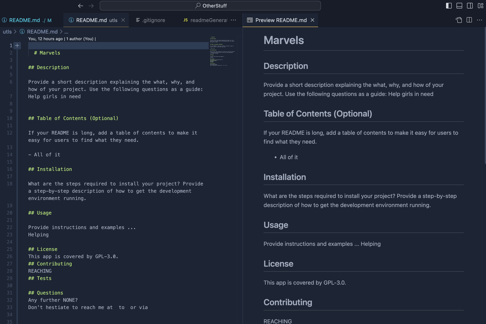

# A Professional - README generator

## Description

it’s important to have a high-quality README for the app. This should include what the app is for, how to use the app, how to install it, how to report issues, and how to make contributions. Basically, the Professional README.md Generator is a powerful tool designed to simplify and streamline the process of creating high-quality README files for your software projects. A well-crafted README.md file is crucial for effective project communication, providing users and developers with essential information about your project's purpose, functionality, and usage.

## TABLE OF CONTENT

- [UserStory](#user)
- [Screencastify Tutor:](#screencastify)
- [Installation](#install)
- [Usage](#usage)
- [Screenshots](#screenshots)
- [REPO](#reposority)

## User Story

As a professional, I want to generate a readme file for my project so that other developers can easily understand the purpose and functionality of my code.

## Screencastify Tutor

[Tutorial how to use app](https://watch.screencastify.com/v/g3HRYyd23O333aJiwiMq)

## Installation

To install the application, you need to have Node.js installed on your computer. You can download it from https://nodejs.org/en
Also includes an Inquirer package which you will in this
link : (https://www.npmjs.com/package/inquirer/v/8.2.4).

To install necessary dependencies, run the following command:
[Followed by instructions](https://coding-boot-camp.github.io/full-stack/github/professional-readme-guide)

[Download The Readme Generator](https://github.com/bcot-code/OtherStuff?search=1)

## Usage

- NODE JS
- INQUIER
- IMAGES

## Screenshots

[Preview README sample]()

## Repository

[My GitHub](https://github.com/bcot-code/OtherStuff)
